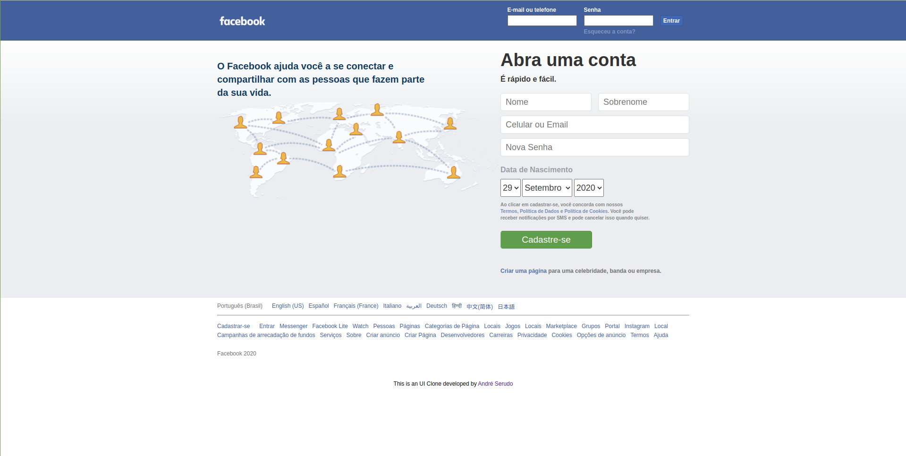
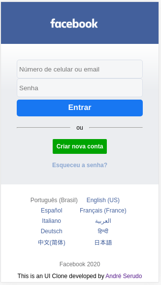

# Facebook Clone

This is a customization that I've done for one of my projects during my study at [Tybe](https://www.betrybe.com/). The goal was to work together with other student, to achieve certains requierements. Was suggested to create a layout basead in the images that are saved in the design folder.

You can check it out what I've done [here](https://facebook-login-serudo.vercel.app/).

# Check how I made it

I tried to make a Pull Request whenever I had the chance, so please, check it out how I worked to make this project. :smile:

## Layout

The UI based in this project were these ones: [Desktop](https://github.com/andreserudo/facebookLogin/blob/main/design/facebook.png?raw=true) and [Mobile](https://github.com/andreserudo/facebookLogin/blob/main/design/facebook-mobile.png?raw=true). The layout was created following the 'Desktop First' development. The breakpoint chose for the mobile version was 440px. I had no reason, in particular, to chose it, I decided based on adjusting the screen and seeing after what width, the layout would not act as it supposed.

> Desktop version

> Mobile version
